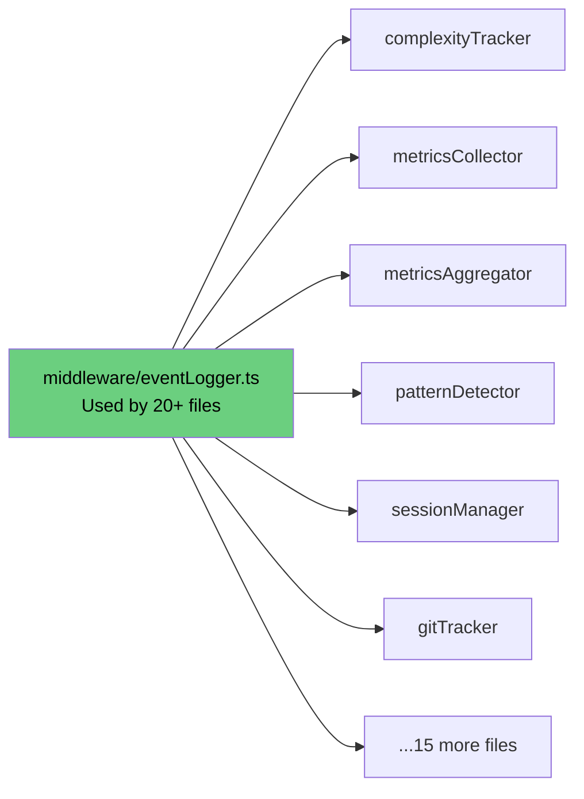

# Current Architecture - The Problem

## The "God File" Hub-and-Spoke Pattern

```mermaid
graph TB
    subgraph "THE PROBLEM"
        SERVER[server.ts<br/>41 DEPENDENCIES<br/>🔴 GOD FILE]
    end
    
    subgraph "Configuration"
        DB[config/database.ts]
        TOOLS[config/toolDefinitions.ts]
    end
    
    subgraph "Handlers - Complexity (4 files doing similar things)"
        HC1[handlers/codeComplexity.ts]
        HC2[handlers/complexity/complexityAnalyze.ts]
        HC3[handlers/complexity/complexityInsights.ts]
        HC4[handlers/complexity/complexityManage.ts]
    end
    
    subgraph "Handlers - Metrics (3 files)"
        HM1[handlers/metrics/metricsAnalyze.ts]
        HM2[handlers/metrics/metricsCollect.ts]
        HM3[handlers/metrics/metricsControl.ts]
    end
    
    subgraph "Handlers - Patterns (2 files)"
        HP1[handlers/patterns/patternAnalyze.ts]
        HP2[handlers/patterns/patternInsights.ts]
    end
    
    subgraph "Handlers - Other"
        H1[handlers/codeAnalysis.ts]
        H2[handlers/context.ts]
        H3[handlers/decisions.ts]
        H4[handlers/naming.ts]
        H5[handlers/navigation.ts]
        H6[handlers/project.ts]
        H7[handlers/smartSearch.ts]
        H8[handlers/tasks.ts]
        H9[handlers/git.ts]
        H10[handlers/outcomeTracking.ts]
        H11[handlers/sessionAnalytics.ts]
    end
    
    subgraph "Services - Too Many!"
        S1[services/complexityTracker.ts]
        S2[services/gitTracker.ts]
        S3[services/metricsCollector.ts]
        S4[services/metricsIntegration.ts]
        S5[services/patternDetector.ts]
        S6[services/sessionTracker.ts]
        S7[services/queueManager.ts]
        S8[services/sessionTimeout.ts]
        S9[services/databasePool.ts]
    end
    
    subgraph "Middleware"
        M1[middleware/ingressValidation.ts]
        M2[middleware/requestLogger.ts]
        M3[middleware/validation.ts]
    end
    
    SERVER --> DB & TOOLS
    SERVER --> HC1 & HC2 & HC3 & HC4
    SERVER --> HM1 & HM2 & HM3
    SERVER --> HP1 & HP2
    SERVER --> H1 & H2 & H3 & H4 & H5 & H6 & H7 & H8 & H9 & H10 & H11
    SERVER --> S1 & S2 & S3 & S4 & S5 & S6 & S7 & S8 & S9
    SERVER --> M1 & M2 & M3
    
    style SERVER fill:#ff6b6b,color:#fff
    style HC1 fill:#ffd93d
    style HC2 fill:#ffd93d
    style HC3 fill:#ffd93d
    style HC4 fill:#ffd93d
```



## Key Issues Visualized

### Issue #1: server.ts imports EVERYTHING
- **41 dependencies** - this file knows about your entire application
- Changes to ANY handler require touching server.ts
- Impossible to test in isolation
- Hard to understand what the app actually does

### Issue #2: Duplicate Services (Color-coded above)

**🟡 COMPLEXITY - 4 similar files:**
- `handlers/codeComplexity.ts` (4 deps)
- `handlers/complexity/complexityAnalyze.ts` (5 deps)
- `handlers/complexity/complexityInsights.ts` (6 deps)
- `handlers/complexity/complexityManage.ts` (5 deps)

**Why is this bad?** Which one do you call? They all do similar things. Logic is spread across 4 places.

**🟣 METRICS - 3 handlers + 4 services = 7 files:**

Handlers:
- `handlers/metrics/metricsAnalyze.ts`
- `handlers/metrics/metricsCollect.ts`
- `handlers/metrics/metricsControl.ts`

Services:
- `services/metricsCollector.ts`
- `services/metricsIntegration.ts`
- `services/metricsAggregator.ts`
- `services/metricsCorrelation.ts`

**Why is this bad?** 7 files to handle metrics! That's 6 too many. They all import each other creating a tangled web.

**🟢 SESSIONS - 8 files:**
- `services/sessionManager.ts`
- `services/unifiedSessionManager.ts` (the name says "unified" but there are 7 others!)
- `services/sessionMigrationManager.ts`
- `services/sessionMigrator.ts`
- `services/sessionRouter.ts`
- `services/sessionTracker.ts`
- `services/sessionMonitoring.ts`
- `services/sessionTimeout.ts`

**Why is this bad?** Which one is THE session manager? Answer: unclear. This is analysis paralysis in code form.

### Issue #3: The "eventLogger" Fanout



**Why is this interesting?** This is actually GOOD design - a shared utility used by many. But notice it's in `middleware/` - should probably be in `utils/`.

### Issue #4: The Hidden Dependencies

Your SVG shows **config/database.ts** has arrows pointing to it from EVERYWHERE. From the JSON:
- **46 files** import `config/database.ts`

This means:
- Change your database config → 46 files potentially affected
- Can't test handlers without database
- Everything is tightly coupled to Postgres

## Files You Should DELETE Immediately

```
❌ server-backup-before-stdio-fix.ts (39 deps)
❌ server_backup.ts (22 deps)
❌ handlers/_deprecated_tt009/ (entire directory)
```

These are backups and deprecated code STILL BEING IMPORTED by active code. Delete them now.

