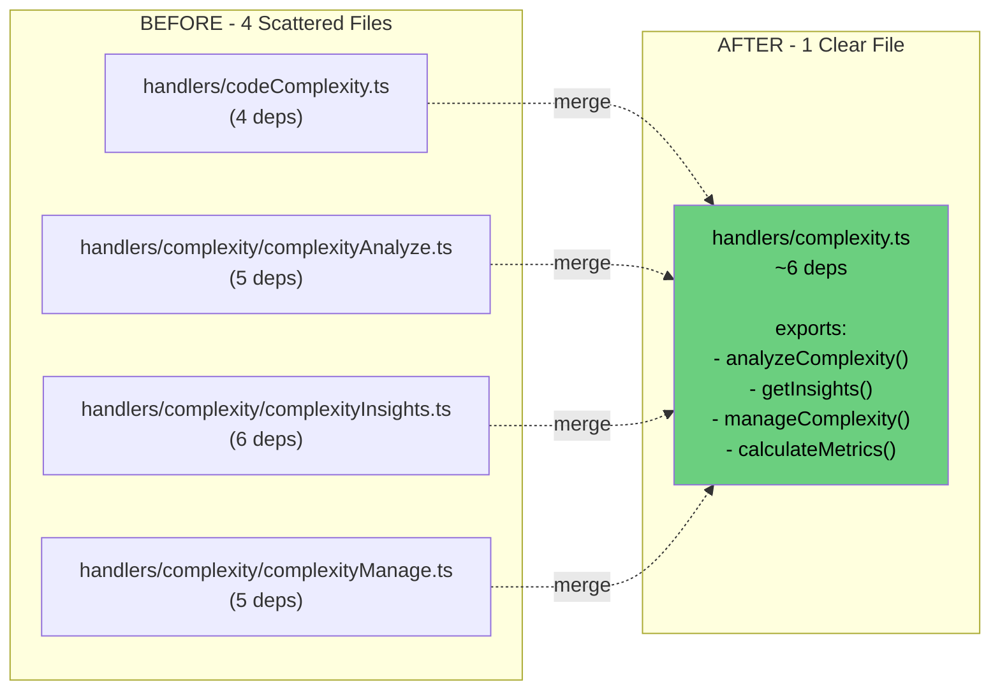
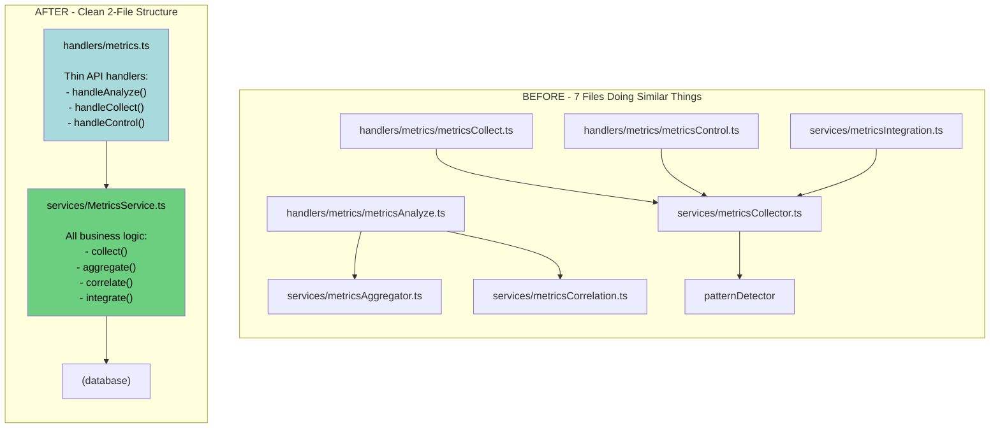
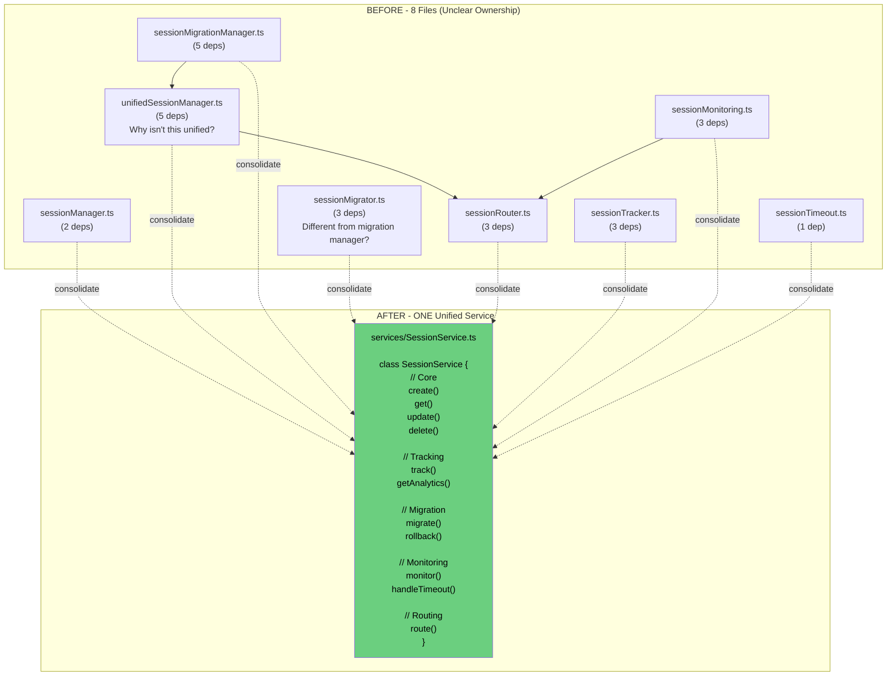
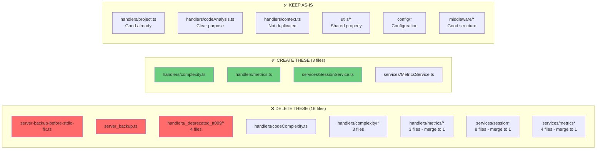

# Visual Consolidation Guide

## 🎯 Your Three Big Merges (Visual)

### 1. COMPLEXITY CONSOLIDATION



**What each file currently does:**
- `codeComplexity.ts` - Basic complexity calculation
- `complexityAnalyze.ts` - Deeper analysis with consolidated types
- `complexityInsights.ts` - Generates insights, calls codeComplexity.ts (!)
- `complexityManage.ts` - Management operations

**The problem:** `complexityInsights.ts` imports `codeComplexity.ts` - they're doing the same thing!

**The solution:** One file with clear exported functions.

---

### 2. METRICS CONSOLIDATION (The Big One!)



**Current tangled web:**
- Handlers call multiple services
- Services call each other
- Logic spread across 7 files
- Where do you add new metrics code? Nobody knows!

**Clean structure:**
- Handlers = thin wrappers, just parse request/response
- Service = all the business logic in ONE place
- Clear ownership

---

### 3. SESSIONS CONSOLIDATION (The Messiest!)



**The naming confusion:**
- `sessionManager` vs `unifiedSessionManager` - which one is "the" manager?
- `sessionMigrationManager` vs `sessionMigrator` - what's the difference?
- `sessionTracker` vs `sessionMonitoring` - aren't these the same?

**Solution:** ONE service class with all methods. Period.

---

## 📋 Step-by-Step Merge Example: Complexity

Let me show you EXACTLY how to do one merge:

### Step 1: Create the new file

```bash
cd ~/aidis/mcp-server
touch src/handlers/complexity.ts
```

### Step 2: Move all the functions

```typescript
// src/handlers/complexity.ts
import { database } from '../config/database';
import { eventLogger } from '../middleware/eventLogger';
import { complexityTracker } from '../services/complexityTracker';
import { sessionManager } from '../services/sessionManager';
import type { ConsolidatedComplexity } from '../types/consolidated-complexity';

// From codeComplexity.ts
export async function calculateComplexity(params: any) {
  // Move implementation here
}

// From complexityAnalyze.ts
export async function analyzeComplexity(params: any) {
  // Move implementation here
}

// From complexityInsights.ts
export async function getComplexityInsights(params: any) {
  // Move implementation here
  // Remove the import to codeComplexity.ts - call calculateComplexity() directly
}

// From complexityManage.ts
export async function manageComplexity(params: any) {
  // Move implementation here
}
```

### Step 3: Update server.ts

```typescript
// BEFORE
import { calculateComplexity } from './handlers/codeComplexity';
import { analyzeComplexity } from './handlers/complexity/complexityAnalyze';
import { getComplexityInsights } from './handlers/complexity/complexityInsights';
import { manageComplexity } from './handlers/complexity/complexityManage';

// AFTER - ONE import!
import { 
  calculateComplexity, 
  analyzeComplexity, 
  getComplexityInsights, 
  manageComplexity 
} from './handlers/complexity';
```

### Step 4: Delete old files

```bash
rm src/handlers/codeComplexity.ts
rm -rf src/handlers/complexity/
```

### Step 5: Test

```bash
npm test
# Or run your test suite
```

**Result:** 4 files → 1 file, same functionality, clearer ownership!

---

## 🎨 Visual Summary: Files to Delete vs Keep



## 📊 Impact Analysis

| Action | Files Deleted | Files Created | Net Change |
|--------|--------------|---------------|------------|
| Delete backups | -2 | 0 | -2 |
| Delete deprecated | -4 | 0 | -4 |
| Merge complexity | -4 | +1 | -3 |
| Merge metrics | -7 | +2 | -5 |
| Merge sessions | -8 | +1 | -7 |
| **TOTAL** | **-25** | **+4** | **-21 files** |

**Result: 87 files → 66 files (24% reduction)**

And more importantly: **crystal clear ownership** of every piece of code.

