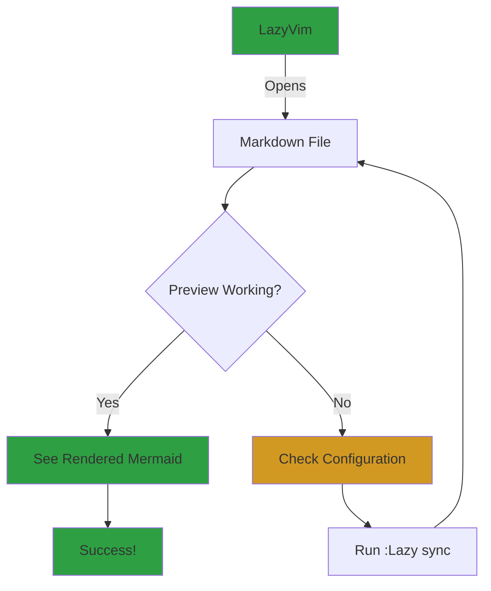
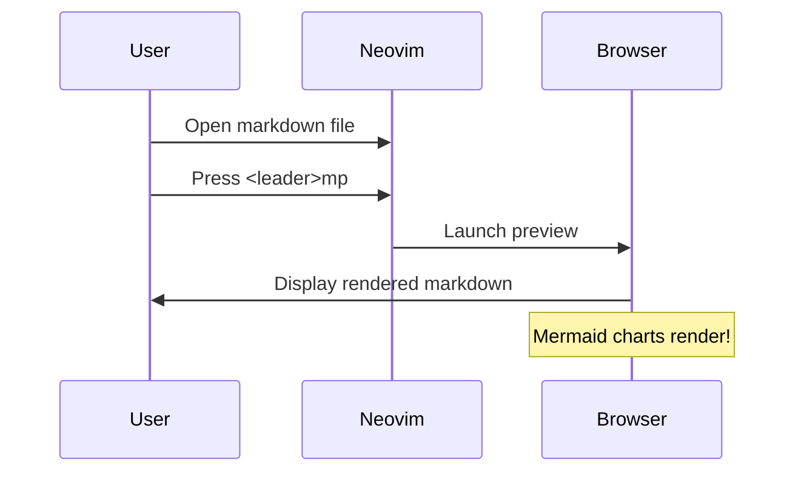

# Markdown Preview Test

This is a test file to verify markdown-preview.nvim is working with Mermaid support.

## Regular Markdown Features

- **Bold text**
- *Italic text*
- `code inline`

```javascript
// Code block
function test() {
  console.log("Hello, world!");
}
```

## Mermaid Diagram Test



## Another Mermaid Example - Sequence Diagram



## Instructions

1. Open this file in Neovim: `nvim test-mermaid.md`
2. Press `<leader>mp` (usually Space + m + p) to toggle preview
3. Your browser should open with the rendered markdown
4. Mermaid diagrams should be visible!

If it doesn't work immediately:
- Run `:Lazy sync` in Neovim to install/update the plugin
- Restart Neovim
- Try again
